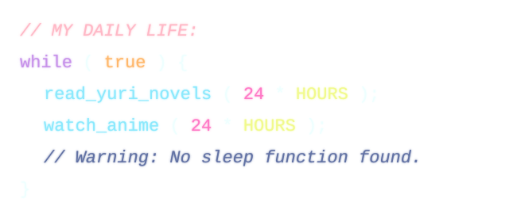

<!-- 顶部的樱花特效 -->
<!--当 GitHub 用  标签加载 sakura.svg 时，浏览器会把这个 SVG 扔进一个严格的隔离沙箱里。为了防止跨站请求伪造CSRF或者追踪像素Tracking Pixels，浏览器会强行阻断 SVG 内部发起的所有外部网络请求。-->
<h1 align="center">👻  𝓬𝓸𝓶𝔂𝓾𝓰𝓮𝓽𝓼𝓾  👻</h1>

  

  

# 🌸 Hi there, I'm 0xhakana-ptr  

  
  
  
  
  
  
  
  
  
   
  
  
  
  
  
  

## ✦ About me 

  <h3>🌸 <b>Aesthetic:</b> A hopeless "White Dolphin" romantic swimming in the world of 2D aesthetics (maybe sometime 3D? But yuri is the best).</h3>
  <h3>⚙️ <b>Hobby:</b> An endless tinkerer who loves breaking and fixing systems.</h3>
  <h3>🐛 <b>Skill:</b> An ambitious developer exceptionally skilled at writing elegant and unexpected bugs.</h3>
  <h3>☘️ <b>Hidden Talent:</b> Possesses the rare endurance to get completely lost in Yuri light novels and anime for an entire day, seamlessly escaping reality.</h3>

<!-- 可爱工具图标 -->

  
  

    

<!--
**0xhakana-ptr/0xhakana-ptr** is a ✨ _special_ ✨ repository because its `README.md` (this file) appears on your GitHub profile.

Here are some ideas to get you started:

- 🔭 I’m currently working on ...
- 🌱 I’m currently learning ...
- 👯 I’m looking to collaborate on ...
- 🤔 I’m looking for help with ...
- 💬 Ask me about ...
- 📫 How to reach me: ...
- 😄 Pronouns: ...
- ⚡ Fun fact: ...
-->
